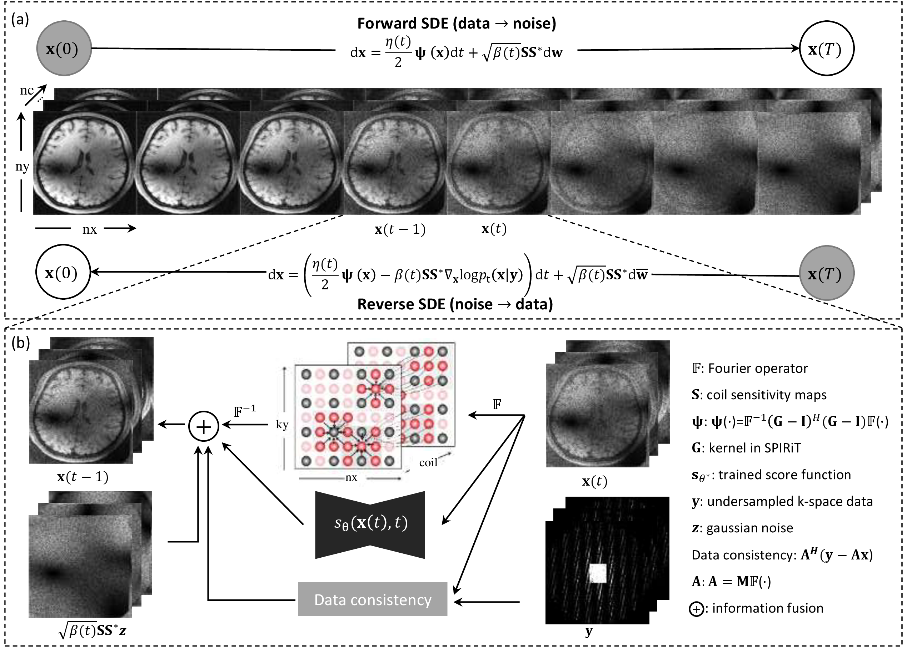

<h1 align="center">SPIRiT-Diffusion: Self-Consistency Driven Diffusion Model for Accelerated MRI</h1>

<p align="center">
    <a href="https://arxiv.org/pdf/2304.05060.pdf"></a>
    <a href="https://ieeexplore.ieee.org/document/10704728/"></a>
</p>

Official code for the paper "[SPIRiT-Diffusion: Self-Consistency Driven Diffusion Model for Accelerated MRI](https://ieeexplore.ieee.org/document/10704728)", published in TMI 2024.

by [Zhuo-Xu Cui*](https://scholar.google.com/citations?user=QZx0xdgAAAAJ&hl=en), [Chentao Cao*](https://scholar.google.com/citations?user=vZPl_oQAAAAJ&hl=en), [Yue Wang*](https://scholar.google.com/citations?user=-pqgxXsAAAAJ&hl=en), [Sen Jia](https://scholar.google.com/citations?user=aCcLh1oAAAAJ&hl=en), [Jing Cheng](https://scholar.google.com/citations?user=voDu8Y4AAAAJ&hl=en), Xin Liu, [Hairong Zheng](https://scholar.google.com/citations?user=gcRVqJsAAAAJ&hl=zh-CN), [Dong Liang](https://scholar.google.com/citations?user=3cAJWoIAAAAJ&hl=en), and [Yanjie Zhu<sup>+</sup>](https://scholar.google.com/citations?user=X2mIoQ4AAAAJ&hl=en) (* denotes equal contribution, + denotes corresponding author).

### Illustration


### Abstract
Diffusion models are leading methods for image generation and have shown success in MRI reconstruction. However, existing diffusion-based methods primarily work in the image domain, making them vulnerable to inaccuracies in coil sensitivity maps (CSMs). While k-space interpolation methods address this issue, conventional diffusion models are not directly applicable to k-space interpolation. To tackle this, we introduce SPIRiT-Diffusion, a k-space interpolation diffusion model inspired by the iterative SPIRiT method. By utilizing SPIRiT’s self-consistent term (k-space physical prior), we formulate a novel stochastic differential equation (SDE) for the diffusion process, enabling k-space data interpolation. This approach highlights the importance of optimization models in designing SDEs, aligning the diffusion process with underlying physical principles, known as model-driven diffusion. Evaluated on a 3D joint intracranial and carotid vessel wall imaging dataset, SPIRiT-Diffusion outperforms image-domain methods, achieving high-quality reconstruction even at an acceleration rate of 10.

## Setup

This section covers environment setup, data preparation, usage instructions, experiment weights, and a quick start guide. In the quick start, we provide experiment weights and synthetic data for easy model validation, without requiring lengthy data downloads. Parameter settings for generating high-quality reconstruction samples are also included.

### Dependencies

Install necessary Python packages:

```sh
pip install -r requirements.txt
```

*Note:* For `conda` users, follow the setup instructions in previous work such as [HFS-SDE](https://github.com/Aboriginer/HFS-SDE).

## Data Preparation

### Example Dataset

We provide instructions to download the [example data](https://drive.google.com/drive/folders/1_amIW2RfD94co-jj_U_cqBlgzBSkAJIG?usp=sharing) and place it in `example_data`, with the data class in `utils/datasets.py/ExampleDataSet`.

#### Preprocessing

In the image domain, crop the data to 320x320 and estimate sensitivity maps using the [BART](https://mrirecon.github.io/bart/) toolbox. The Auto-Calibration Signal (ACS) region is set to 48x48.

* `Sensitivity Estimation:` Use the [BART](https://mrirecon.github.io/bart/) toolbox to estimate sensitivity maps. Code is in `data_prepare/generate_smaps_fastMRI.py`. Code for generating Sum of Squares (SOS) coefficients is available in `data_prepare/estimate_sos_map.py`.

* `Kernel Estimation:` The code is located in `data_prepare/estimate_kernel.py`.

## Usage

Train and evaluate models via `main.py`:

```sh
main.py:
  --config: Training configuration (default: 'None')
  --mode: <train|sample> Running mode: train or sample
  --workdir: Working directory
```

* `config`: Path to config file, formatted with [`ml_collections`](https://github.com/google/ml_collections).
* `workdir`: Path to store experiment artifacts (e.g., checkpoints, samples, results).
* `mode`: "train" to start training, "sample" to run sampling.

## Pretrained Checkpoints

Checkpoints are available [here](https://drive.google.com/drive/folders/1y0-lOmyEiqNp0Xxfo_ntnvhfSiCqEgYR?usp=sharing).

## Quick Start Guide

### Training

Use the training script `train_fastMRI.sh`:

- Set the following parameters based on the table below:

| Parameter            | Meaning                                   | Example Value                                         |
| -------------------- | ----------------------------------------- | ----------------------------------------------------- |
| `training.estimate_csm` | Type of coil sensitivity map             | `bart` or `sos`                                       |

Train the model:

```sh
bash train_fastMRI.sh spirit
```

### Sampling

Apply our model using phantom data for high-quality reconstruction. Set the sampling parameters as shown:

| Parameter                | Meaning                                                      | Example Value      |
| ------------------------ | ------------------------------------------------------------ | ------------------ |
| `sampling.snr`           | Adjusts noise level; higher values reduce noise, lower values reduce artifacts | 0 - 1              |
| `sampling.mse`           | Controls overall predictor error; larger values increase the weight of the score | Non-negative       |
| `sampling.corrector_mse` | Controls overall corrector error; larger values give more weight to the score | Non-negative       |
| `model.eta`              | Step size; affects image details and smoothness               | 0 - 1              |

*Note:* Prioritize adjusting `model.eta` to ensure it is within an appropriate range.

Run sampling:

```sh
bash test_fastMRI.sh spirit
```

When encountering a process lock, run:

```sh
bash rm_lock.sh
```

## References

If you find the code useful, please cite:

```bib
@article{cui2024spirit,
  title={SPIRiT-Diffusion: Self-consistency driven diffusion model for accelerated MRI},
  author={Cui, Zhuo-Xu and Cao, Chentao and Wang, Yue and Jia, Sen and Cheng, Jing and Liu, Xin and Zheng, Hairong and Liang, Dong and Zhu, Yanjie},
  journal={IEEE Transactions on Medical Imaging},
  year={2024},
  publisher={IEEE}
}
```

Our implementation is based on [Score-based SDE](https://github.com/yang-song/score_sde_pytorch) by Dr. Yang Song, with additional code from [csgm-mri-langevin](https://github.com/utcsilab/csgm-mri-langevin). Many thanks to their authors!
